# Hi, I'm Waya

<div align="center">
  
</div>

<div align="center">
  <a href="mailto:lespuavres@gmail.com">
    
  </a>
  <a href="https://twitter.com/Les_pauvres/">
    
  </a>
  
</div>

<br />

<div align="center">
  
</div>

## About Me

我是一名坐标重庆的技术实践者，同时担任重庆市弧鸦创新科技有限公司（ArcRaven）的技术负责人（CTO），也是软件团队 Huginn 的核心构建者。

我关注机器人、智能硬件和 AI 工程化落地：从 PCB、嵌入式系统、工业级硬件调试，到 Flutter、Rust/Tauri、Linux 开发环境和智能体工作流，我习惯把想法推进到可以真实运行、交付和迭代的状态。

## Current Focus

- 🧠 构建面向研发效率的 AI Agent / Long-Agent 工作流，把自动化能力接入真实工程链路。
- 🤖 带领 RoboMaster 千里战队，协同机械、电子、视觉与算法成员推进机器人系统设计。
- 🧩 打磨 ArcRaven 与 Huginn 的产品化能力，连接智能硬件、跨平台软件与高效交互体验。
- 🔧 深入 STM32C5 系列、嵌入式 Rust、Flutter、Tauri 与 Linux 桌面工作流。
- 🖥️ 使用 Fedora + Niri + Catppuccin 作为主力环境，追求稳定、可复现、可扩展的开发体验。

## Tech Stack

<div align="center">
  
</div>

<br />

| Layer | Tools & Experience |
| --- | --- |
| Embedded & Hardware | STM32C5, ARM Cortex-M, PCB bring-up, firmware architecture, hardware debugging |
| Cross-platform Apps | Flutter, Rust/Tauri, TypeScript, Kotlin, desktop/mobile product engineering |
| AI & Automation | LLM applications, agent workflows, local model tooling, build farm automation |
| Robotics | RoboMaster systems, machine vision, mechanical-electrical-software collaboration |
| Development Environment | Fedora, Niri, Catppuccin, Linux tooling, Raspberry Pi + Mac mini build farm |
| Design & Engineering | Rhino 8, SolidWorks, Fusion 360, UE5, product prototyping |

## What I'm Building

```text
ArcRaven       AI + intelligent hardware, from prototype to product
Huginn         Software team for reliable cross-platform engineering
PixelPad       Hardware/software pixel-art creation experience
Long-Agent     Agentic workflow experiments for real R&D automation
RoboMaster     Team-scale robotics engineering and competition systems
```

## Professional Snapshot

> 你好，我是 Waya，一名跨学科的技术实践者，长期在机器人、智能硬件与 AI 工程化领域深耕。

作为 ArcRaven 的技术负责人，我致力于把前沿 AI 技术与工程化落地结合。我具备从 PCB 设计、底层嵌入式系统开发，到跨平台软件架构的全栈技术经验。无论是开发 AI 辅助交互设备，还是构建自动化研发环境，我都希望通过代码和硬件创造更高效、更自然的交互体验。

## Geek Mode

```rust
struct Waya {
    city: &'static str,
    roles: [&'static str; 3],
    daily_stack: [&'static str; 5],
    belief: &'static str,
}

let me = Waya {
    city: "Chongqing",
    roles: [
        "ArcRaven CTO",
        "Huginn core builder",
        "RoboMaster Qianli team leader",
    ],
    daily_stack: ["Rust", "Flutter", "STM32C5", "Fedora + Niri", "AI Agents"],
    belief: "Technology expands the boundary of human expression.",
};
```

## GitHub Pulse

<div align="center">
  
  
</div>

<div align="center">
  
</div>

## Let's Connect

如果你对机器人技术、智能硬件产品化、AI Agent 工作流、嵌入式系统或高性能开发环境感兴趣，欢迎交流。

- Email: [lespuavres@gmail.com](mailto:lespuavres@gmail.com)
- Twitter/X: [@Les_pauvres](https://twitter.com/Les_pauvres/)
